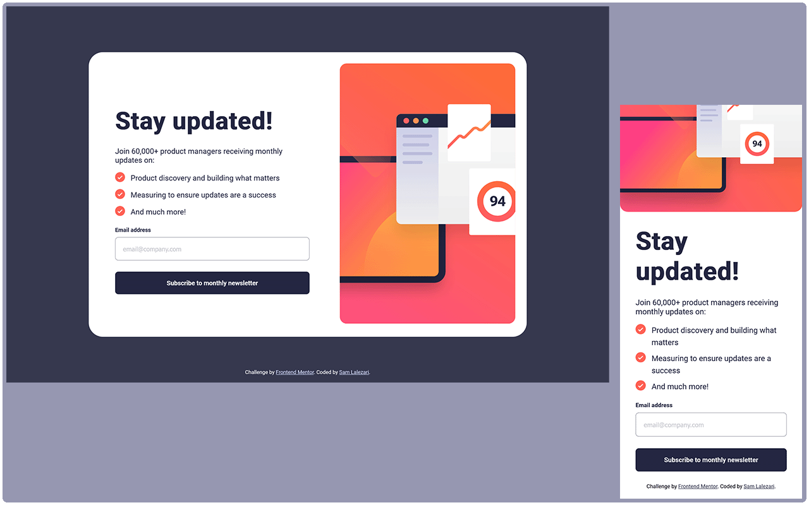

# Frontend Mentor - Newsletter sign-up form with success message solution

This is a solution to the [Newsletter sign-up form with success message challenge on Frontend Mentor](https://www.frontendmentor.io/challenges/newsletter-signup-form-with-success-message-3FC1AZbNrv). Frontend Mentor challenges help you improve your coding skills by building realistic projects.

## Table of contents

- [Overview](#overview)
  - [The challenge](#the-challenge)
  - [Screenshot](#screenshot)
  - [Links](#links)
- [My process](#my-process)
  - [Built with](#built-with)
  - [Useful resources](#useful-resources)
- [Author](#author)

## Overview

### The challenge

Users should be able to:

- Add their email and submit the form
- See a success message with their email after successfully submitting the form
- See form validation messages if:
  - The field is left empty
  - The email address is not formatted correctly
- View the optimal layout for the interface depending on their device's screen size
- See hover and focus states for all interactive elements on the page

### Screenshot

### Links

- Solution URL: [View on GitHub](https://github.com/lalezaris/frontend-mentor-01-newsletter-sign-up-with-success-message-main)
- Live Site URL: [samlalezari.com/frontend-mentor-01-newsletter-sign-up-with-success-message-main](https://samlalezari.com/frontend-mentor-01-newsletter-sign-up-with-success-message-main/)

## My process

### Built with

- Semantic HTML5
- CSS
- JavaScript

### Useful resources

- [CSS Gradient](https://cssgradient.io/) - Useful tool for generating CSS gradients, used in the button hover states.

## Author

- Website - [SamLalezari.com](https://www.samlalezari.com)
- Frontend Mentor - [@lalezaris](https://www.frontendmentor.io/profile/lalezaris)
